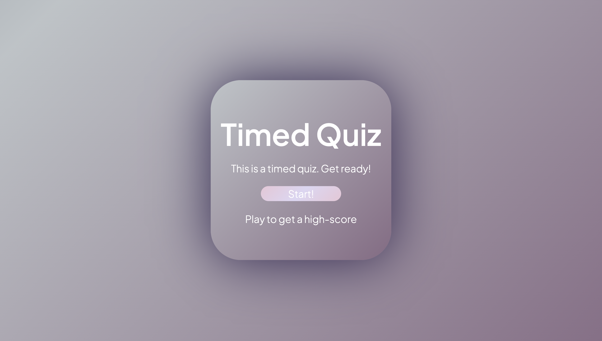
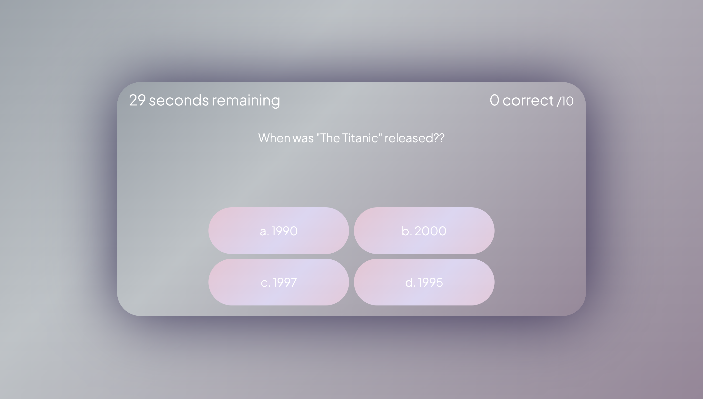
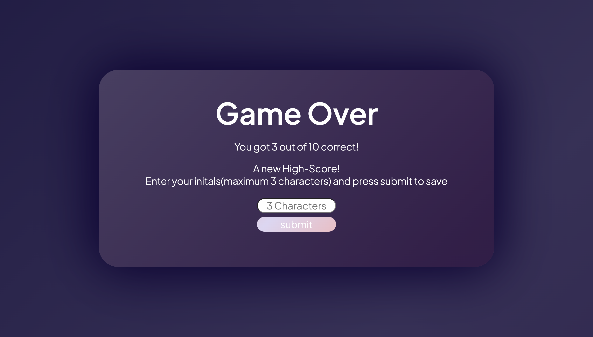

# Timed Quiz

## Description

This Repository holds the code for a pure javascript-based quiz game with custom questions. 
This Project allowed me to get a better idea of how javascript functions and variables work together.
The planning phase was extremely important and was part of why I was able to complete with little headache compared to other projects, despite the comparitive complexity.
Had I not planned as well as I did, this project would have taken well over 25 hours to complete with the amount of resesarch I had to do.

## Installation

N/A

## Usage

To begin the quiz, simply press the "start" button on the homepage.

Then, answer the questions to the best of your ability, but be quick, because you only have 30 seconds to get through 10.
Should you get one wrong, 5 seconds will be taken from your total remaining time.
A correct response will add one point to your total.

Once all questions are answered, or all time is exhausted, you will be asked to enter your initials to save your high-score. 
On future plays, you will only be prompted to enter you Initials if you have a score higher than the current saved score. This score is saved in local storage.

## Credits

N/A

## License

Please refer to the LICENCE file in the repo
